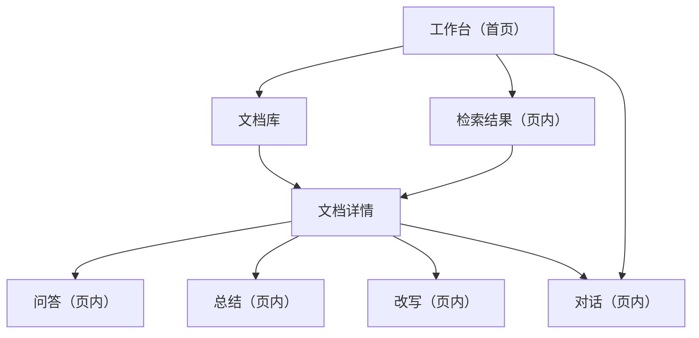

## 1. Product Overview
面向你的“智能文档助手”桌面端工作台：围绕文档获取、检索、问答、总结、改写与对话六类能力，提供一致的输入与结果呈现。
目标是让你以最少步骤把一个文档从“找到/打开”推进到“可用答案与可交付文本”。

## 2. Core Features

### 2.1 Feature Module
本产品最小可用需求包含以下页面：
1. **工作台（首页）**：工具切换（检索/问答/总结/改写/对话）、全局输入区、结果区、运行状态与错误提示。
2. **文档库**：加载与浏览文档列表（来自 /api/docs）、快速筛选/搜索入口、打开文档详情。
3. **文档详情**：展示文档内容/元信息；在当前文档上下文内执行问答/总结/改写/对话；展示历史结果。

### 2.3 Page Details
| Page Name | Module Name | Feature description |
|-----------|-------------|---------------------|
| 工作台（首页） | 工具导航 | 切换 5 个工具视图：检索(/api/search)、问答(/api/qa)、总结(/api/summarize)、改写(/api/rewrite)、对话(/api/chat)。 |
| 工作台（首页） | 全局输入与参数 | 输入 query/question/text/messages 等；可选指定 docId（未指定时提示去文档库选择）。 |
| 工作台（首页） | 执行与状态 | 点击运行触发对应 API；展示 idle/loading/success/error；失败时展示 message 并允许重试。 |
| 工作台（首页） | 结果渲染 | 以“结构化卡片 + 可复制文本”为主渲染：检索结果列表、问答答案、总结文本、改写对照、聊天消息流。 |
| 文档库 | 文档列表 | 调用 GET /api/docs；以列表/表格展示标题、更新时间（若有）；支持点击进入详情。 |
| 文档库 | 快速操作 | 在列表项上提供“在工作台中使用”快捷入口（带 docId 回填）。 |
| 文档详情 | 文档展示 | 展示文档标题/来源/正文（若接口返回）；提供复制与折叠长文。 |
| 文档详情 | 文档内操作 | 在 docId 上下文执行 /api/qa、/api/summarize、/api/rewrite、/api/chat；结果按时间线保存于本地会话（前端状态）。 |
| 文档详情 | 结果历史 | 展示本页产生的最近 N 条结果；支持一键复制与清空历史。 |

## 3. Core Process
- 浏览文档流：进入工作台 → 打开文档库 → 浏览列表(/api/docs) → 进入文档详情。
- 检索流：在工作台选择“检索” → 输入 query → 调用 /api/search → 查看结果 → 可跳转到某条结果对应的文档详情（若返回 docId）。
- 文档内问答/总结/改写流：进入文档详情（已具备 docId）→ 选择能力并输入内容 → 调用对应 API → 查看结果 → 复制/继续追问。
- 对话流：在工作台或文档详情进入“对话” → 输入消息 → 调用 /api/chat → 将 assistant 消息追加到时间线。

