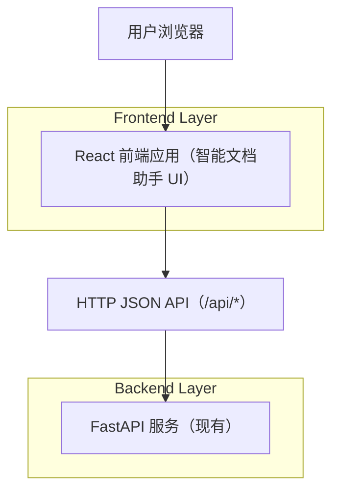

## 1.Architecture design


## 2.Technology Description
- Frontend: React@18 + React Router + Tailwind CSS + Vite
- Data Fetch: fetch（或 axios）+ AbortController（取消请求）
- Backend: FastAPI（你已有，对齐以下端点：/api/docs,/api/search,/api/qa,/api/summarize,/api/rewrite,/api/chat）

## 3.Route definitions
| Route | Purpose |
|-------|---------|
| / | 工作台：执行检索/问答/总结/改写/对话并展示结果 |
| /docs | 文档库：浏览文档列表（/api/docs） |
| /docs/:docId | 文档详情：在 docId 上下文执行操作并查看历史 |

## 4.API definitions (If it includes backend services)
> 以下为前端对接的“最小共享类型建议”，具体字段以你的后端返回为准。

### 4.1 /api/docs
- GET /api/docs
```ts
export type DocSummary = { id: string; title?: string; updatedAt?: string };
export type DocsResponse = { items: DocSummary[] };
```

### 4.2 /api/search
- POST /api/search
```ts
export type SearchRequest = { query: string; topK?: number };
export type SearchHit = { docId: string; title?: string; snippet?: string; score?: number };
export type SearchResponse = { hits: SearchHit[] };
```

### 4.3 /api/qa
- POST /api/qa
```ts
export type QARequest = { question: string; docId?: string };
export type QAResponse = { answer: string; citations?: Array<{ docId: string; snippet?: string }> };
```

### 4.4 /api/summarize
- POST /api/summarize
```ts
export type SummarizeRequest = { text?: string; docId?: string; style?: 'short'|'bullet'|'detailed' };
export type SummarizeResponse = { summary: string };
```

### 4.5 /api/rewrite
- POST /api/rewrite
```ts
export type RewriteRequest = { text: string; instruction?: string; docId?: string };
export type RewriteResponse = { rewritten: string };
```

### 4.6 /api/chat
- POST /api/chat
```ts
export type ChatMessage = { role: 'system'|'user'|'assistant'; content: string };
export type ChatRequest = { messages: ChatMessage[]; docId?: string };
export type ChatResponse = { message: ChatMessage };
```