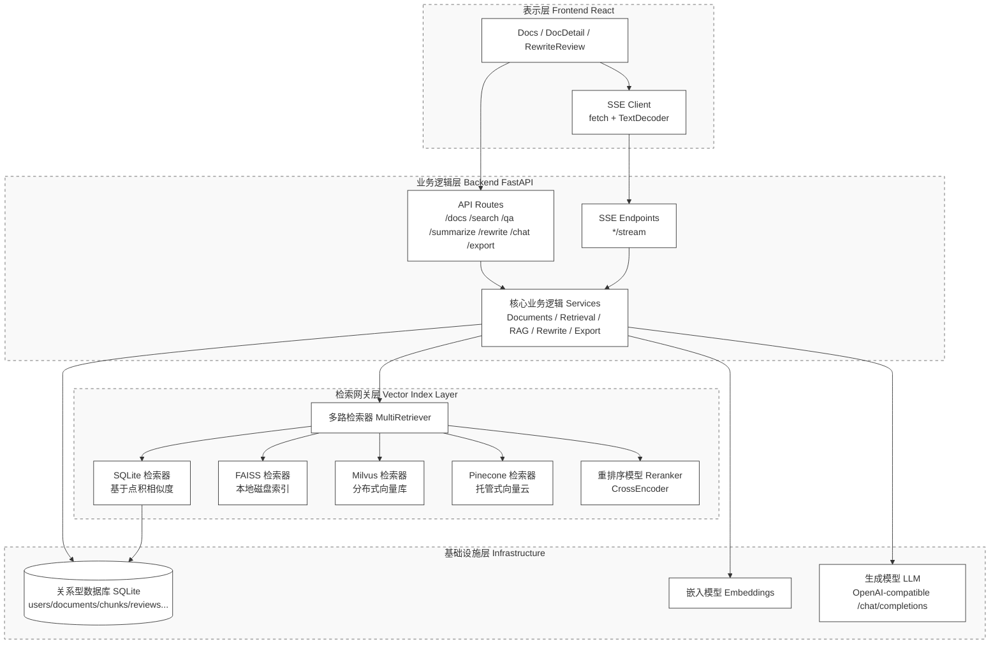
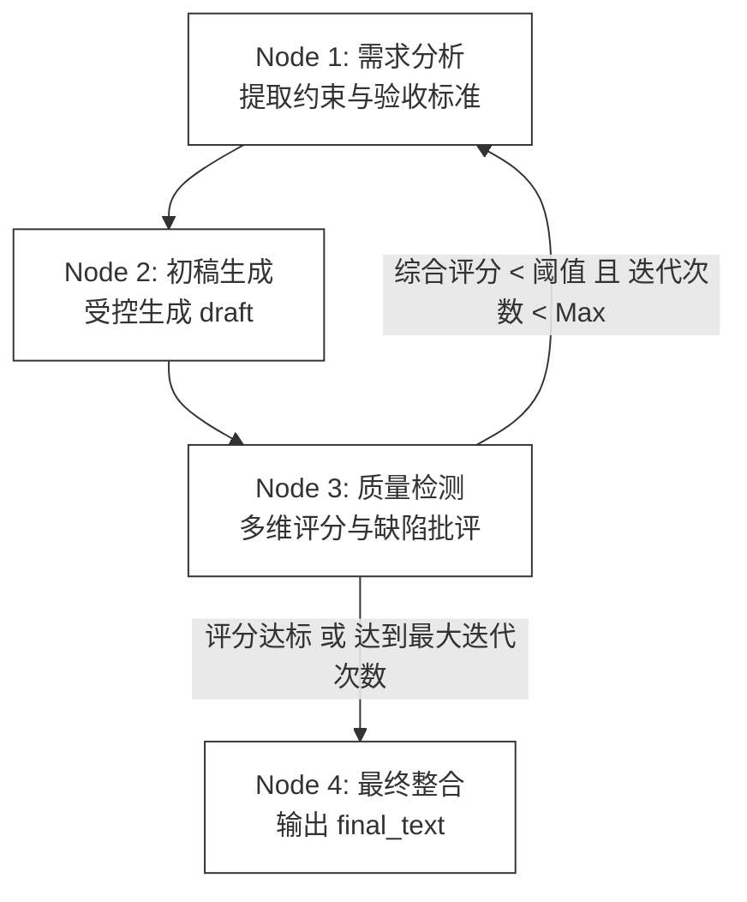
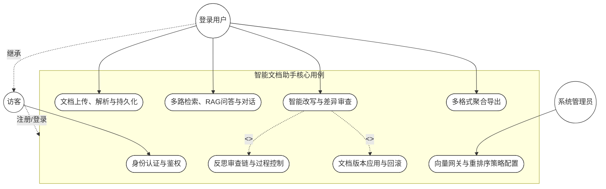

# 面向知识管理的智能文档助手：多路检索与反思生成架构设计

**作者**：__________  
**单位**：__________  
**日期**：__________  

---

## 摘要
随着大型语言模型（Large Language Models, LLMs）的快速发展，生成式人工智能在文档管理与知识问答领域的应用日益广泛。然而，现有系统在处理长文本知识时常面临检索精度不足、生成内容存在“幻觉”（Hallucination）、以及自动化编辑缺乏有效审查与回滚机制等挑战。本文提出并设计了一种面向个人与团队知识库的智能文档助手系统。该系统构建了包含 SQLite、FAISS、Milvus 及 Pinecone 在内的可插拔多路向量检索（Multi-way Vector Retrieval）架构，并引入 CrossEncoder 重排序（Reranking）机制以显著提升召回结果的语义相关性。在文本生成与改写方面，本文创新性地引入了“反思范式”（Reflection Paradigm），通过多智能体协作（Multi-agent Collaboration）与质量门控循环实现高可控的文本迭代。此外，系统在全链路实现了基于服务器发送事件（Server-Sent Events, SSE）的低延迟流式交互，并结合细粒度的版本控制算法，保障了改写操作的可审查性与安全性。本文详细阐述了该系统的体系结构、核心算法机制以及工程实现方案，为构建高可靠的下一代知识管理系统提供了理论参考与实践范式。

**关键词**：智能文档助手；检索增强生成（RAG）；多路向量检索；重排序（Reranking）；反思范式（Reflection Paradigm）；流式交互

---

## 1 引言
在信息爆炸的背景下，如何高效地存储、检索并深度利用非结构化文档数据，是知识管理领域的核心命题。大型语言模型（LLM）展现出了卓越的自然语言理解与生成能力，但其自身受限于上下文窗口长度与静态参数知识，难以直接作为高可靠的垂直领域知识库引擎。

检索增强生成（Retrieval-Augmented Generation, RAG）技术通过将外部知识库作为非参数化记忆注入到模型的上下文中，有效缓解了 LLM 的“幻觉”问题。然而，在实际工程落地中，RAG 系统仍面临诸多挑战：单一的向量检索算法往往难以兼顾精确匹配与海量数据的近似近邻（ANN）查询；传统生成式改写操作缺乏透明度，用户难以干预中间过程；系统层面的交互延迟极大地影响了用户体验。

为解决上述问题，本文设计并实现了一套端到端的智能文档助手系统。本文的主要贡献包括：
1. **提出可插拔的多路混合检索架构**：融合了本地精准匹配（SQLite）、单机高性能索引（FAISS）与分布式向量数据库（Milvus/Pinecone），并结合 CrossEncoder 重排序，提升了知识召回的鲁棒性与精确度。
2. **构建基于反思范式的改写审查工作流**：将文本改写解构为需求分析、初稿生成、质量检测与最终整合四个阶段，结合闭环门控机制与细粒度差异（Diff）版本控制，实现改写过程的安全可控。
3. **实现全链路低延迟的流式系统**：基于 SSE 协议，不仅实现 Token 级别的文本流式输出，更创新性地将多节点工作流的内部状态同步回显至前端，提升了系统的可观测性。

---

## 2 相关工作
### 2.1 检索增强生成（RAG）与向量存储
RAG 技术的核心在于高效准确的知识召回。近年来，以 FAISS 为代表的本地近似近邻搜索库，以及以 Milvus、Pinecone 为代表的云原生向量数据库得到了广泛应用。本系统在设计上汲取了上述系统的优势，提出了一种多路并行的检索网关设计，以适应从单机到分布式集群的不同部署规模。

### 2.2 LLM 反思与自迭代机制
早期的 LLM 应用多采用单轮提示（Zero-shot Prompting）。近期的研究（如 Reflexion 等）表明，引入反馈循环与自我反思（Self-Reflection）机制能够显著提升模型在复杂推理和文本生成任务上的表现。本系统将该理论应用于长文本改写任务中，通过引入“质量检测”节点作为批评者（Critic），实现了系统级的自我迭代。

---

## 3 系统架构设计
本系统采用经典的前后端分离与微服务化分层架构设计。整体划分为表示层（前端）、业务逻辑层（后端 API 与服务）、检索网关层以及基础设施层。

### 3.1 总体架构图

**图 1. 系统总体架构图**

---

## 4 核心方法与关键技术

### 4.1 多路混合检索与重排序模型
单一向量数据库在面对复杂检索意图时可能存在召回短板。本系统设计了 `MultiRetriever` 模块。给定用户查询 $q$，系统并发向集合 $B = \{b_1, b_2, \dots, b_n\}$ 中的已启用向量后端发起查询。

在 SQLite 基线后端中，系统对查询向量 $\vec{q}$ 与文档分块向量 $\vec{v}$ 进行 L2 归一化，其相似度得分 $S_{base}$ 计算如下：
$$ S_{base}(q, v) = \frac{\vec{q} \cdot \vec{v}}{\|\vec{q}\|_2 \|\vec{v}\|_2} + \alpha \cdot f_{keyword}(q, text_v) $$
其中 $f_{keyword}$ 为基于词频的关键词增益函数，$\alpha$ 为权重系数。

各后端召回的候选集合经合并与去重后，系统引入 CrossEncoder 进行重排序（Reranking）。与双塔模型（Bi-encoder）不同，CrossEncoder 将查询与文档片段拼接后联合输入 Transformer 模型，输出深层语义匹配得分，进而截断选取 Top-$K$ 结果返回至上层 RAG 模块。

### 4.2 基于反思范式的自迭代改写机制
在传统的文本改写中，系统难以保证改写结果的格式合规性与语义忠实度。本文引入基于有限状态机（FSM）的反思审查链（Reflection Review Chain）。该工作流定义了四个核心节点：

1. **需求分析节点（$N_1$）**：解析原始文本与用户意图，输出结构化需求与验收标准（Acceptance Criteria）。
2. **初稿生成节点（$N_2$）**：基于 $N_1$ 的约束生成文本初稿。
3. **质量检测节点（$N_3$）**：作为批评者（Critic），独立评估 $N_2$ 输出的语义忠实度、风格匹配度与约束合规性，输出多维度评分与布尔类型的通过标志（Pass Flag）。
4. **最终整合节点（$N_4$）**：处理 $N_3$ 发现的阻断性缺陷（Blocking Issues），输出最终文本。

**循环门控机制**：若 $N_3$ 的综合评分低于预设阈值 $\tau$ 或存在未满足的硬性约束，工作流将回退至 $N_1$，重新执行反思与生成。为防止陷入死循环，系统设定了最大迭代次数（Max Loops）。

**图 2. 反思范式工作流**

### 4.3 细粒度版本控制与一致性保障
为降低自动改写带来的破坏性编辑风险，系统实现了一套基于乐观锁（Optimistic Locking）的文本版本控制算法。改写引擎生成的并非替换文本，而是包含上下文的差异数据（Diff Opcodes）。
- **提交与应用（Commit & Apply）**：系统校验当前文本的 SHA-256 哈希值，若与基线一致，则应用修改，并触发该文档的向量区块（Chunks）全量重建，保障“文本-向量”强一致性。
- **回滚机制（Rollback）**：用户可通过审查历史记录，安全地将文档状态逆转至任意快照节点，并同步恢复对应的检索索引。

---

## 5 系统实现

### 5.1 模块交互与用例建模
系统为不同权限的实体提供了完善的业务功能。前端通过 React 构建响应式 UI，后端由 FastAPI 提供高性能异步接口。

**图 3. 系统用例图**

### 5.2 低延迟流式交互（SSE）的实现
为了优化大语言模型生成过程中的首字节到达时间（Time To First Byte, TTFB），系统后端全面采用 SSE 协议下发异步生成流。
在 `/stream` 端点中，系统定义了规范的事件协议：
- `event: progress`：用于广播检索阶段状态（如 `stage: retrieve`）及改写链节点流转状态，使后端业务编排对用户透明。
- `event: token`：用于透传 LLM 生成的增量文本片段。
前端通过 `TextDecoder` 实时解析流式分块，驱动 React 状态更新，实现了媲美原生桌面应用的流畅交互体验。

---

## 6 讨论与未来工作
本系统在实现多路检索、反思改写与流式响应方面取得了预期效果。然而，在实际应用中仍存在进一步优化的空间：
1. **向量同步延迟**：当前外部向量库（如 Milvus/Pinecone）的索引同步采用阻塞式操作。未来可引入基于消息队列（如 Kafka/RabbitMQ）的异步 Outbox 模式，实现最终一致性，以降低主链路的请求延迟。
2. **重排序性能瓶颈**：CrossEncoder 计算复杂度较高。后续研究可探索引入基于知识蒸馏（Knowledge Distillation）的轻量级 Reranker，或采用前缀缓存（Prefix Caching）技术加速推理。
3. **多模态扩展**：目前文档解析主要针对纯文本与有限结构的 PDF/Word。引入视觉语言模型（VLM）以处理复杂图表和数学公式，将是提升知识库覆盖率的重要方向。

---

## 7 结论
本文详细阐述了一款面向知识管理的智能文档助手系统的总体架构与核心机制设计。通过融合多路向量检索网关与 CrossEncoder 重排序，系统显著提升了 RAG 问答的准确性；创新性引入的基于反思范式的改写工作流及细粒度版本控制，在赋予 LLM 强大编辑能力的同时，确保了结果的安全可控。配合全链路流式 SSE 交互，本系统为构建高效、可靠、体验优秀的下一代智能化知识管理平台提供了坚实的工程基础与参考实现。
